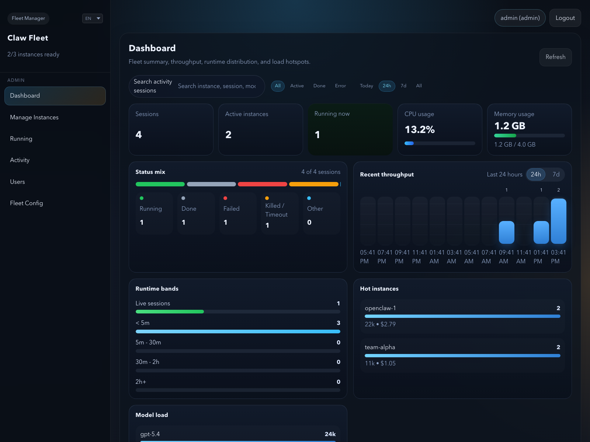
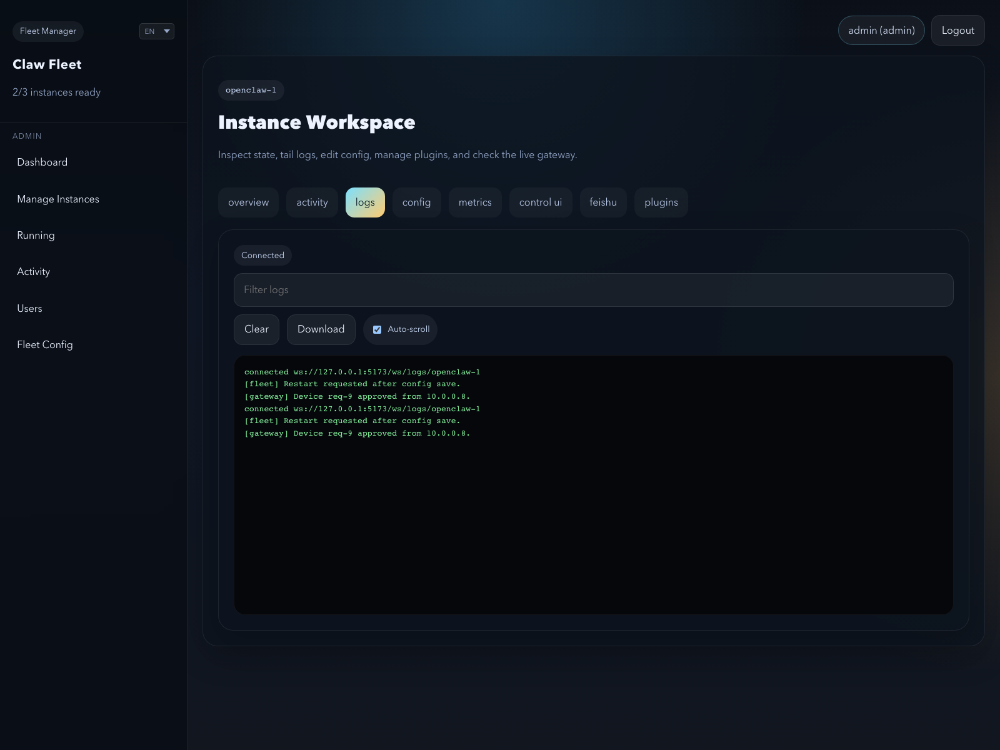
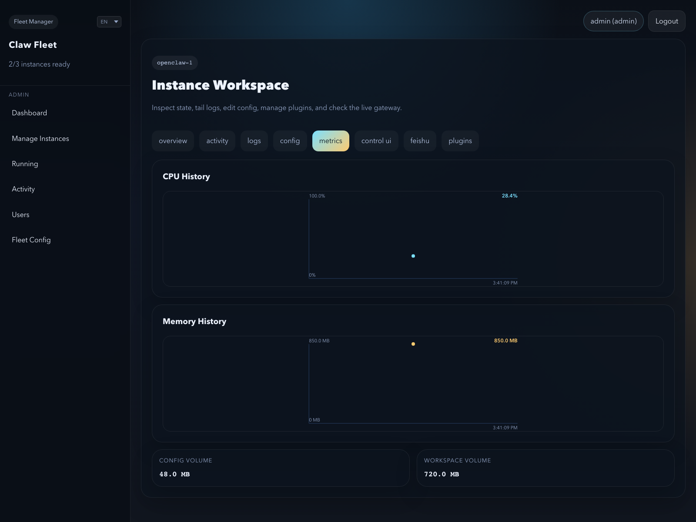
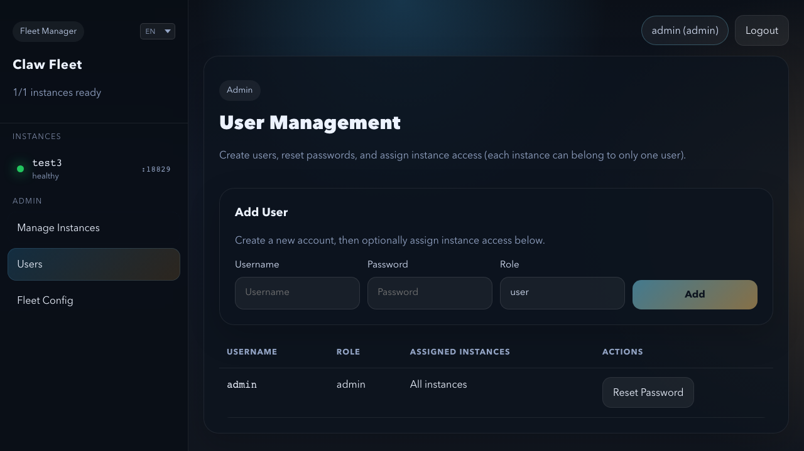
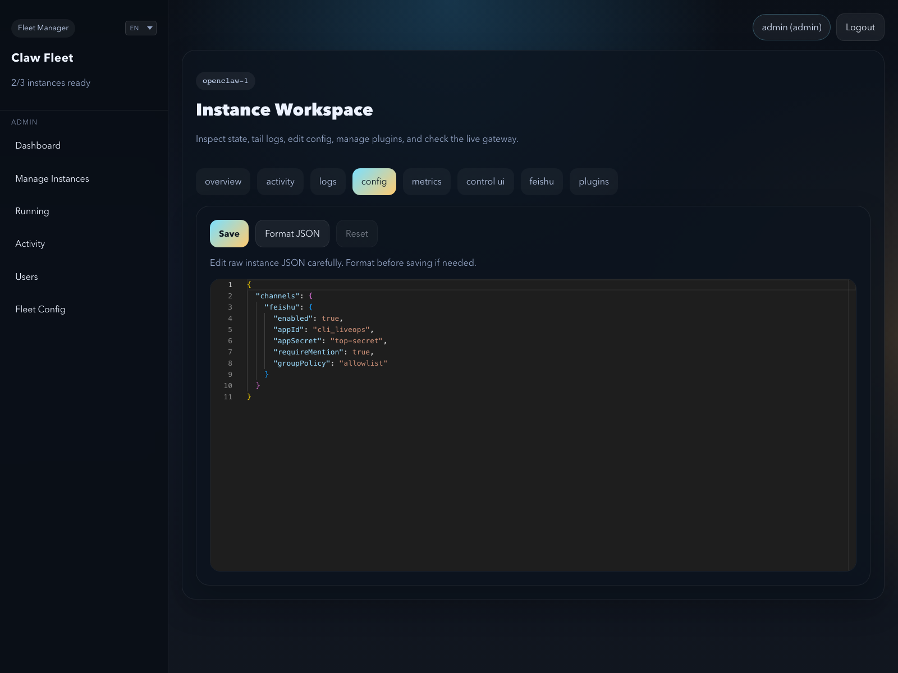
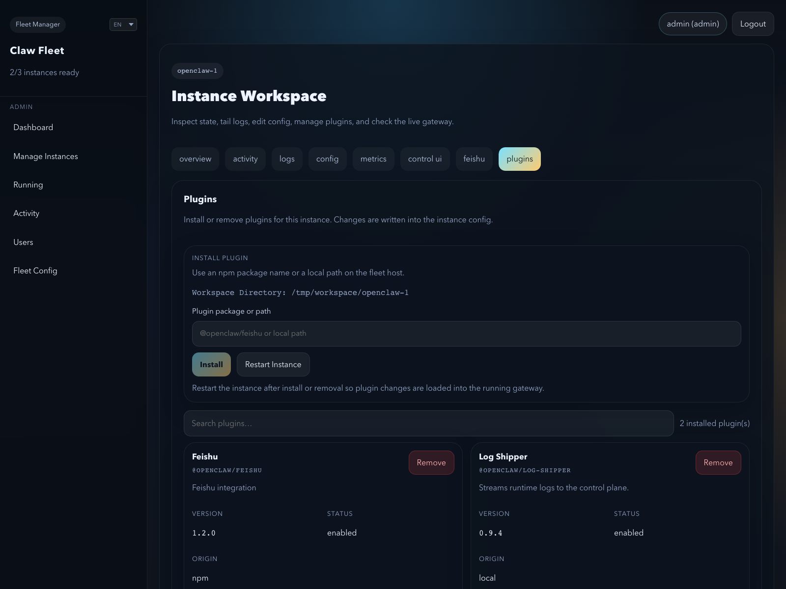
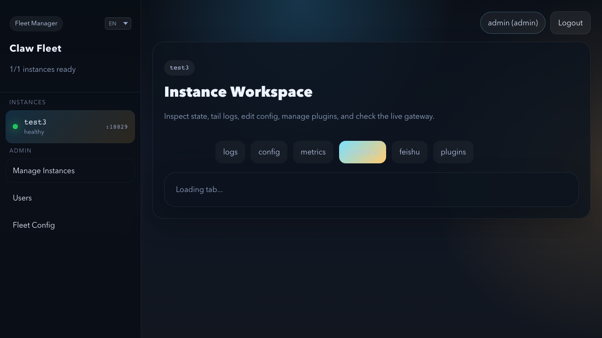

# Claw Fleet Manager

<p align="center">
  <strong>English</strong> | <a href="README_CN.md">简体中文</a>
</p>

<p align="center">
  <strong>Manage an OpenClaw and Hermes fleet from the browser.</strong><br/>
  Start, stop, configure, and monitor OpenClaw profile instances plus OpenClaw and Hermes Docker gateway instances from one dashboard.
</p>

<p align="center">
  
  
  
  
</p>

<p align="center">
  <a href="docs/arch/README.md">Architecture</a> ·
  <a href="docs/guides/installation-guide.md">Installation Guide</a> ·
  <a href="docs/guides/docker-deployment.md">Docker Deployment</a> ·
  <a href="docs/guides/admin-guide.md">Admin Guide</a> ·
  <a href="docs/guides/admin-quick-reference.md">Quick Reference</a> ·
  <a href="tests/README.md">Tests</a>
</p>

<p align="center">
  
</p>

**Claw Fleet Manager** is a web UI and API server for operating multiple OpenClaw and Hermes gateway instances without living in the terminal.

It supports a **hybrid fleet** model — OpenClaw profile instances, OpenClaw Docker instances, and Hermes Docker instances — all in one dashboard with shared lifecycle actions, logs, config editing, metrics, and access control.

Use it when you want to:

- manage a mixed-runtime fleet instead of a single local instance
- give admins and operators a usable control surface
- monitor health, uptime, CPU, memory, and disk in one place
- inspect logs and edit per-instance config without SSH-heavy workflows
- mix native profile deployments and Docker deployments in the same environment

## What you can do

| Capability | OpenClaw profile | OpenClaw docker | Hermes docker |
|---|:---:|:---:|:---:|
| Fleet overview and health metrics | ✓ | ✓ | ✓ |
| Start / stop / restart instances | ✓ | ✓ | ✓ |
| Live log streaming over WebSocket | ✓ | ✓ | ✓ |
| Edit per-instance config | ✓ | ✓ | ✓ |
| Multi-user access with admin / user roles | ✓ | ✓ | ✓ |
| Create / remove / rename instances | ✓ | ✓ | ✓ |
| Embedded Control UI via reverse proxy | ✓ | ✓ | — |
| Device approval and Feishu pairing | ✓ | ✓ | — |
| Install / uninstall plugins | ✓ | ✓ | — |
| Activity/session tab | ✓ | ✓ | — |
| Migrate between profile and Docker | ✓ | ✓ | — |
| Auto-restart on crash | ✓ | — | — |
| Per-instance Tailscale HTTPS URLs | — | ✓ | — |

Hermes instances share the fleet list with OpenClaw instances; OpenClaw-only features are hidden automatically.

## Screenshots

<table>
  <tr>
    <td align="center"><b>Live Logs</b></td>
    <td align="center"><b>Metrics</b></td>
    <td align="center"><b>User Management</b></td>
  </tr>
  <tr>
    <td></td>
    <td></td>
    <td></td>
  </tr>
  <tr>
    <td align="center"><b>Config</b></td>
    <td align="center"><b>Plugins</b></td>
    <td align="center"><b>Control UI</b></td>
  </tr>
  <tr>
    <td></td>
    <td></td>
    <td></td>
  </tr>
</table>

## Quick start

```bash
npm install
cp packages/server/server.config.example.json packages/server/server.config.json
cp packages/web/.env.example packages/web/.env.local
npm run dev
```

Edit `packages/server/server.config.json` before starting:

- Set `fleetDir`, `auth.username`, and `auth.password`
- Remove the `tls` block (or point it to real cert files) — the server reads those files on startup and will crash if the paths are placeholders
- Remove the `tailscale` block unless you have Tailscale installed and configured

Default local endpoints:

- Dashboard: `http://localhost:5173`
- API server: `https://localhost:3001`

→ Full setup instructions: [Installation Guide](docs/guides/installation-guide.md)

## Docker deployment

```bash
chmod +x scripts/docker-deploy.sh
./scripts/docker-deploy.sh
```

| Default | Value |
|---|---|
| Manager URL | `http://localhost:3001` |
| Admin login | `admin` / `changeme` |
| Data root | `.docker-data/claw-fleet-manager` |

→ Overrides, TLS, and image config: [Docker Deployment Guide](docs/guides/docker-deployment.md)

## Architecture

```text
         Browser
            │
            ▼
    ┌───────────────────────────┐
    │    React Dashboard        │
    │         (Vite)            │
    └────────────┬──────────────┘
                 │
                 ▼
    ┌───────────────────────────┐
    │    Fastify API Server     │
    │      ├─ Auth + Users      │
    │      ├─ Fleet config      │
    │      └─ Logs / Proxy      │
    └────────────┬──────────────┘
                 │
          HybridBackend
    ┌────────────┼────────────┐
    │            │             │
ProfileBackend  DockerBackend  HermesDockerBackend
openclaw        openclaw-N     hermes
--profile       containers     containers
```

For the full architecture walkthrough, see [docs/arch/README.md](docs/arch/README.md).

## Docs

- [docs/guides/installation-guide.md](docs/guides/installation-guide.md)
- [docs/guides/installation-guide-cn.md](docs/guides/installation-guide-cn.md)
- [docs/guides/docker-deployment.md](docs/guides/docker-deployment.md)
- [docs/guides/admin-guide.md](docs/guides/admin-guide.md)
- [docs/guides/admin-quick-reference.md](docs/guides/admin-quick-reference.md)
- [docs/guides/development.md](docs/guides/development.md)
- [docs/guides/docker-deployment-cn.md](docs/guides/docker-deployment-cn.md)
- [docs/guides/development-cn.md](docs/guides/development-cn.md)
- [docs/arch/README.md](docs/arch/README.md)

## License

Apache 2.0. See [LICENSE](LICENSE).
