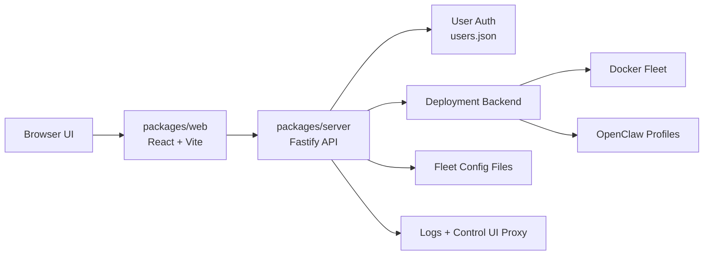

# Claw Fleet Manager

Claw Fleet Manager is a Turbo/npm-workspaces monorepo for operating an `openclaw` fleet from a browser.

- `packages/server`: Fastify API for auth, fleet orchestration, config I/O, log streaming, and reverse proxying
- `packages/web`: React 19 + Vite dashboard for fleet status, config editing, metrics, logs, and instance actions

The server supports two deployment backends:

- `docker`: manage `openclaw-*` containers in an existing fleet directory
- `profiles`: manage native `openclaw` profile processes without Docker

## Features

- Fleet overview with cached status refresh, health, CPU, memory, disk, uptime, and image details
- Start, stop, and restart individual instances
- Fleet-wide config editing plus Docker fleet scaling
- Per-instance `openclaw.json` editing
- Live log streaming over WebSockets
- Embedded Control UI via authenticated reverse proxy
- Device approval and Feishu pairing flows from the dashboard
- Profile mode instance creation/removal and plugin install/uninstall
- Multi-user access with persisted users, admin/user roles, and per-profile assignment
- Admin UI for creating users, resetting passwords, and granting profile access
- Optional Tailscale integration for per-instance URLs

## Repository Layout

```text
.
├── packages/
│   ├── server/   Fastify server, backends, routes, tests
│   └── web/      React/Vite dashboard
├── docs/arch/    architecture notes
├── turbo.json    workspace task graph
└── README.md
```

## ASIC Diagram



## Requirements

Choose the requirements that match your deployment mode:

- All modes: Node.js with npm workspaces support, plus `npm install`
- Docker mode: Docker / Docker Compose and an existing openclaw fleet directory
- Profile mode: `openclaw` available on `PATH`
- Optional: `tailscale` CLI if `tailscale.hostname` is configured

## Authentication and Users

- The server stores users in `users.json` under `fleetDir`.
- On first startup, the credentials in `server.config.json.auth` are bootstrapped as the initial `admin` user.
- After that, authentication is user-based rather than a single shared password file.
- `admin` users can access all instances, manage users, reset passwords, and assign profile access.
- `user` users can sign in, change their own password, and only see profile-mode instances assigned to them.

## Local Development

1. Install dependencies:

```bash
npm install
```

2. Create the server config:

```bash
cp packages/server/server.config.example.json packages/server/server.config.json
```

3. Edit `packages/server/server.config.json`.

- Set `fleetDir` to your actual fleet directory.
- Keep `deploymentMode: "docker"` for container orchestration, or switch to `profiles` and fill in the `profiles` block.
- `auth.username` and `auth.password` seed the initial admin account on first boot.
- The current Vite dev proxy targets `https://localhost:3001`, so the default `npm run dev` flow expects `tls.cert` and `tls.key` to be configured in `server.config.json`.
- If you want to run the backend without TLS in development, update [`packages/web/vite.config.ts`](/Users/qiyuangong/.codex/worktrees/f612/claw-fleet-manager/packages/web/vite.config.ts) to proxy to `http://localhost:3001` instead.

4. Create the web env file:

```bash
cp packages/web/.env.example packages/web/.env.local
```

5. Set `VITE_BASIC_AUTH_USER` and `VITE_BASIC_AUTH_PASSWORD` in `packages/web/.env.local` to match `packages/server/server.config.json`.

6. Start the workspace:

```bash
npm run dev
```

This starts the Vite app on `http://localhost:5173` and the Fastify server on port `3001`.

## How It Works

- The web app calls `/api/*` with Basic Auth headers sourced from `packages/web/.env.local`.
- The server authenticates users against `users.json` and protects HTTP, WebSocket, and proxied Control UI traffic with Basic Auth, proxy cookies, and short-lived HMAC proxy tokens.
- In production builds, the server serves `packages/web/dist` directly when those assets exist.
- The web shell includes an account menu, self-service password change, and an admin-only user management view.

Key server endpoints include:

- `/api/health`
- `/api/fleet`
- `/api/fleet/scale`
- `/api/fleet/:id/start|stop|restart`
- `/api/fleet/:id/config`
- `/api/fleet/:id/token/reveal`
- `/api/fleet/:id/devices/pending`
- `/api/fleet/:id/feishu/pairing`
- `/api/fleet/profiles` and `/api/fleet/:id/plugins*` in profile mode
- `/api/users`, `/api/users/me`, `/api/users/:username/password`, and `/api/users/:username/profiles`
- `/ws/logs` and `/ws/logs/:id`
- `/proxy/*` and `/proxy-ws/*`

For a deeper system walkthrough, see [docs/arch/README.md](docs/arch/README.md).

## Commands

From the repository root:

```bash
npm run dev
npm run build
npm run test
npm run lint
```

Useful package-specific commands:

```bash
npm --workspace @claw-fleet-manager/server run dev
npm --workspace @claw-fleet-manager/server run test
npm --workspace @claw-fleet-manager/web run dev
npm --workspace @claw-fleet-manager/web run build
npm --workspace @claw-fleet-manager/web run lint
```

## Testing

The server package includes route and service tests under `packages/server/tests`.

```bash
npm --workspace @claw-fleet-manager/server run test
```

## License

Apache 2.0. See [LICENSE](LICENSE).
