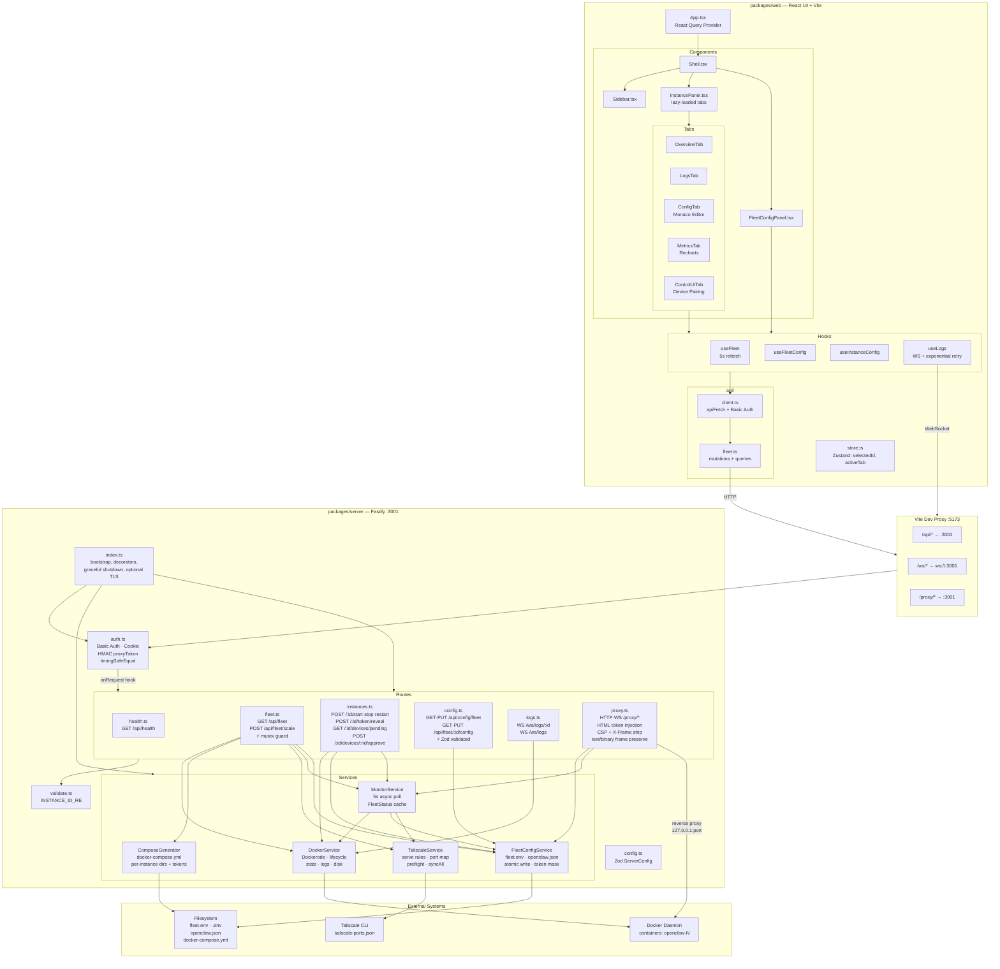

# Claw Fleet Manager — Architecture

## Overview

Claw Fleet Manager is an npm workspaces monorepo (Turbo build) for managing a fleet of `openclaw` Docker containers via a web dashboard. It consists of two packages:

| Package | Stack | Purpose |
|---------|-------|---------|
| `packages/server` | Fastify, Dockerode, Zod, ws | HTTP/WebSocket API, Docker orchestration, config I/O, reverse proxy |
| `packages/web` | React 19, Vite, React Query, Zustand, Recharts, Monaco | Dashboard UI for fleet status, lifecycle, config editing, logs, metrics |

## System Diagram



## Data Flow

```
Browser ─── apiFetch() ───► Vite Proxy (:5173) ───► Fastify Auth ───► Route Handler ───► Service ───► Docker/FS/Tailscale
   │                                                     │                  │                │
   │ WebSocket (/ws/logs)                          Basic Auth          id validation     atomic write
   │ WebSocket (/proxy/*)                          Cookie auth         Zod schemas       execFile (no shell)
   └──────────────────────► Vite Proxy (ws) ──────► HMAC proxyToken    mutex (scale)     Promise.all stats
                                                                                         async dir traversal
```

### Request Lifecycle

1. **Browser** sends HTTP or WebSocket request to Vite dev server (`:5173`)
2. **Vite proxy** forwards `/api/*`, `/ws/*`, `/proxy/*` to Fastify (`:3001`)
3. **Auth hook** (`onRequest`) validates credentials:
   - HTTP routes: `Authorization: Basic <base64>`
   - WebSocket routes: `?auth=<base64>` query param or cookie
   - Proxy subrequests: `?proxyToken=<hmac>` or `x-fleet-proxy-auth` cookie
4. **Route handler** validates input (instance id regex, Zod body schemas)
5. **Service** performs business logic against Docker daemon, filesystem, or Tailscale CLI
6. **Response** returned to browser; React Query caches and re-fetches on interval

### Production Mode

In production, Fastify serves the built web assets from `packages/web/dist/` directly. The Vite proxy is not used. A single `npm run build && node packages/server/dist/index.js` deployment serves both API and UI.

## Server Details

### Services

| Service | File | Responsibility | Key Details |
|---------|------|---------------|-------------|
| **DockerService** | `services/docker.ts` | Docker API wrapper via Dockerode | Lists `openclaw-*` containers, start/stop/restart, stream stats (CPU/memory), stream logs, `docker system df` for disk usage |
| **FleetConfigService** | `services/fleet-config.ts` | Reads/writes fleet configuration files | Parses `fleet.env` (key=value), reads `.env` for `TOKEN_N=...`, reads/writes per-instance `openclaw.json`. All writes use atomic tmp+rename. Token masking: first 4 + `***` + last 4 chars |
| **MonitorService** | `services/monitor.ts` | Periodic fleet status aggregation | Polls every 5s via `setInterval`. Fetches container stats in parallel (`Promise.all`). Async directory size calculation (`fs/promises`). Caches `FleetStatus` for instant reads. Populates `tailscaleUrl` from TailscaleService |
| **ComposeGenerator** | `services/compose-generator.ts` | Generates `docker-compose.yml` | Creates per-instance service definitions with port mapping, resource limits (`cpuLimit`, `memLimit`), healthcheck, `cap_drop: ALL`, `no-new-privileges`, `read_only` filesystem. Preserves existing tokens, generates new ones for new instances |
| **TailscaleService** | `services/tailscale.ts` | Manages Tailscale serve rules | Allocates HTTPS ports starting at `BASE_TS_PORT` (8800). Runs `tailscale serve` via `execFile`. Persists port map to `tailscale-ports.json`. `syncAll()` restores missing serve rules on startup. Non-fatal errors (teardown/setup failures are logged, not thrown) |

### Routes

| File | Endpoints | Auth | Validation |
|------|-----------|------|------------|
| `health.ts` | `GET /api/health` | Basic Auth | None |
| `fleet.ts` | `GET /api/fleet` | Basic Auth | None |
| | `POST /api/fleet/scale` | Basic Auth | Zod: `{ count: positive int }`, mutex guard |
| `instances.ts` | `POST /api/fleet/:id/start` | Basic Auth | Instance id regex |
| | `POST /api/fleet/:id/stop` | Basic Auth | Instance id regex |
| | `POST /api/fleet/:id/restart` | Basic Auth | Instance id regex |
| | `POST /api/fleet/:id/token/reveal` | Basic Auth | Instance id regex |
| | `GET /api/fleet/:id/devices/pending` | Basic Auth | Instance id regex |
| | `POST /api/fleet/:id/devices/:requestId/approve` | Basic Auth | Instance id regex + UUID regex |
| `config.ts` | `GET /api/config/fleet` | Basic Auth | None |
| | `PUT /api/config/fleet` | Basic Auth | Zod: `Record<string, string>` |
| | `GET /api/fleet/:id/config` | Basic Auth | Instance id regex |
| | `PUT /api/fleet/:id/config` | Basic Auth | Instance id regex + Zod: `Record<string, unknown>` |
| `logs.ts` | `WS /ws/logs/:id` | Query auth / Cookie | Instance id regex |
| | `WS /ws/logs` | Query auth / Cookie | None |
| `proxy.ts` | `* /proxy/*` | Basic Auth / Cookie / HMAC token | Instance lookup via MonitorService |
| | `WS /proxy/*` | Query auth / Cookie / HMAC token | Instance lookup |

### Authentication

```
                    ┌─────────────┐
                    │  onRequest  │
                    │    hook     │
                    └──────┬──────┘
                           │
                    ┌──────▼──────┐
                    │ Basic Auth  │──── yes ──► ALLOW
                    │  header?    │
                    └──────┬──────┘
                           │ no
                    ┌──────▼──────┐
                    │ Is proxy/   │──── no ───► 401 + www-authenticate
                    │ ws/ path?   │
                    └──────┬──────┘
                           │ yes
                    ┌──────▼──────┐
                    │  Cookie?    │──── yes ──► ALLOW
                    └──────┬──────┘
                           │ no
                    ┌──────▼──────┐
                    │ HMAC proxy  │──── yes ──► ALLOW
                    │   Token?    │
                    └──────┬──────┘
                           │ no
                    ┌──────▼──────┐
                    │ ?auth=      │──── yes ──► ALLOW + set cookie
                    │ query param │
                    └──────┬──────┘
                           │ no
                    ┌──────▼──────┐
                    │    401      │
                    │ (no prompt  │
                    │  on /proxy) │
                    └─────────────┘
```

- **Credential comparison** uses `crypto.timingSafeEqual` to prevent timing attacks
- **HMAC proxy token** is generated per proxied HTML page (`generateProxyToken()`), valid for 24 hours, signed with a per-process random secret. Avoids embedding raw Basic Auth credentials in injected JavaScript
- **Cookie** (`x-fleet-proxy-auth`) is `HttpOnly; SameSite=Strict; Path=/proxy`

### Proxy HTML Injection

When the reverse proxy serves an HTML page from an openclaw instance, it injects a `<script>` tag before `</head>` that:

1. Stores the gateway token in `sessionStorage` keyed by the gateway URL
2. Sets `gatewayUrl` in `localStorage` under `openclaw.control.settings.v1`
3. Wraps `window.WebSocket` to automatically append `?proxyToken=<hmac>` to proxied WebSocket connections
4. Intercepts `sessionStorage.getItem` to return the token for any openclaw token key

Upstream `Content-Security-Policy` and `X-Frame-Options` headers are stripped to allow the injected script and iframe embedding.

WebSocket messages are forwarded preserving their text/binary frame type (`isBinary` flag), which is required for the openclaw Control UI to correctly parse challenge nonces for device identity signing.

### TLS / HTTPS

The server supports optional TLS via the `tls` config field (`cert` and `key` file paths). HTTPS is required for remote Control UI access because the openclaw gateway requires a [secure context](https://developer.mozilla.org/en-US/docs/Web/Security/Secure_Contexts) (HTTPS or localhost) to generate device identity keys via `crypto.subtle`.

### Remote Control UI Access

When the fleet manager is accessed from a non-localhost address without Tailscale, the **ControlUiTab** routes users through the built-in reverse proxy (`/proxy/:id/`) instead of the direct gateway port. The proxy injects the gateway token and patches WebSocket connections with HMAC auth tokens, enabling full Control UI functionality from any remote machine over HTTPS.

### Port Allocation

```
Instance index:  1        2        3        4
Gateway port:    18789    18809    18829    18849
                 ▲        ▲        ▲        ▲
                 │        │        │        │
                 BASE_GW_PORT + (index - 1) * portStep
                 (18789)              (default portStep = 20)

Tailscale port:  8800     8801     8802     8803
                 ▲
                 BASE_TS_PORT (8800), incremented per instance
```

### Concurrency & Reliability

- **Scale mutex**: Only one `POST /api/fleet/scale` request runs at a time; concurrent requests receive `409 SCALE_IN_PROGRESS`
- **Graceful shutdown**: `SIGTERM`/`SIGINT` handlers stop MonitorService interval and drain Fastify connections
- **Atomic file writes**: All config writes go to a `.tmp` file first, then `rename()` to the target path
- **Non-fatal Tailscale errors**: Setup/teardown failures are logged but never crash the scale operation
- **Docker stats resilience**: Per-container stats/inspect failures return zero values; the fleet status still populates

### Container Security

Generated `docker-compose.yml` applies these per-container constraints:

- `cap_drop: [ALL]` — drop all Linux capabilities
- `security_opt: [no-new-privileges:true]` — prevent privilege escalation
- `read_only: true` — read-only root filesystem
- `cpus` and `mem_limit` — resource capping from fleet config
- `healthcheck` — periodic liveness check via HTTP

## Web Details

### State Management

| Layer | Tool | Purpose |
|-------|------|---------|
| UI state | Zustand (`store.ts`) | Selected instance ID, active tab |
| Server state | React Query (hooks) | Fleet status, config, instance config — auto-refetch |
| Logs | WebSocket (`useLogs`) | Real-time streaming with 3-retry exponential backoff, 1000-line buffer cap |

### Component Tree

```
App (React Query Provider)
└── Shell
    ├── Sidebar
    │   └── SidebarItem[] (status badge per instance)
    ├── FleetConfigPanel (when no instance selected)
    │   └── Scale controls, env editing
    └── InstancePanel (when instance selected)
        ├── OverviewTab — status, lifecycle buttons, CPU/memory bars
        ├── LogsTab — WebSocket stream, filter, download, auto-scroll
        ├── ConfigTab — Monaco JSON editor for openclaw.json
        ├── MetricsTab — Recharts line graphs (120 data points max)
        └── ControlUiTab — gateway URL (proxied for remote), token reveal, device pairing, launch
```

Tab components are **lazy-loaded** via `React.lazy()` to reduce initial bundle size.

### API Client

`apiFetch()` in `api/client.ts` automatically attaches `Authorization: Basic <base64>` from `VITE_BASIC_AUTH_USER` / `VITE_BASIC_AUTH_PASSWORD` env vars. All API functions in `api/fleet.ts` use this client.

## Key Types

```typescript
interface FleetInstance {
  id: string;              // "openclaw-1"
  index: number;           // 1
  status: 'running' | 'stopped' | 'restarting' | 'unhealthy' | 'unknown';
  port: number;            // gateway port (18789 + offset)
  token: string;           // always masked (first4***last4)
  tailscaleUrl?: string;   // "https://host.tailnet.ts.net:8800"
  uptime: number;
  cpu: number;
  memory: { used: number; limit: number };
  disk: { config: number; workspace: number };
  health: 'healthy' | 'unhealthy' | 'starting' | 'none';
  image: string;
}

interface FleetStatus {
  instances: FleetInstance[];
  totalRunning: number;
  updatedAt: number;
}

interface FleetConfig {
  baseUrl: string; apiKey: string; modelId: string;
  count: number; cpuLimit: string; memLimit: string;
  portStep: number; configBase: string; workspaceBase: string; tz: string;
}

interface ServerConfig {
  port: number;
  auth: { username: string; password: string };
  fleetDir: string;
  tailscale?: { hostname: string };
  tls?: { cert: string; key: string };
}
```

## Testing

Tests live in `packages/server/tests/` using **Vitest**. Run with:

```bash
cd packages/server && npx vitest run
```

| Category | Files | Pattern |
|----------|-------|---------|
| Route tests | `tests/routes/{auth,config,fleet,health,instances,logs,proxy}.test.ts` | Fastify `inject()` with mocked services |
| Service tests | `tests/services/{docker,fleet-config,compose-generator,monitor,tailscale}.test.ts` | Dependency injection with mock Dockerode, temp filesystem dirs |

## Directory Structure

```
claw-fleet-manager/
├── packages/
│   ├── server/
│   │   ├── src/
│   │   │   ├── index.ts              # Bootstrap, decorators, shutdown
│   │   │   ├── auth.ts               # Auth middleware + HMAC tokens
│   │   │   ├── config.ts             # Zod config loader
│   │   │   ├── validate.ts           # Instance id regex
│   │   │   ├── types.ts              # Shared interfaces
│   │   │   ├── fastify.d.ts          # Fastify type augmentation
│   │   │   ├── routes/
│   │   │   │   ├── health.ts
│   │   │   │   ├── fleet.ts
│   │   │   │   ├── instances.ts
│   │   │   │   ├── config.ts
│   │   │   │   ├── logs.ts
│   │   │   │   └── proxy.ts
│   │   │   └── services/
│   │   │       ├── docker.ts
│   │   │       ├── fleet-config.ts
│   │   │       ├── monitor.ts
│   │   │       ├── compose-generator.ts
│   │   │       └── tailscale.ts
│   │   ├── tests/
│   │   │   ├── routes/
│   │   │   └── services/
│   │   └── server.config.example.json
│   └── web/
│       ├── src/
│       │   ├── App.tsx
│       │   ├── main.tsx
│       │   ├── store.ts
│       │   ├── types.ts
│       │   ├── api/
│       │   │   ├── client.ts
│       │   │   └── fleet.ts
│       │   ├── hooks/
│       │   │   ├── useFleet.ts
│       │   │   ├── useFleetConfig.ts
│       │   │   ├── useInstanceConfig.ts
│       │   │   └── useLogs.ts
│       │   └── components/
│       │       ├── layout/
│       │       ├── instances/
│       │       ├── config/
│       │       └── common/
│       └── vite.config.ts
├── turbo.json
├── tsconfig.base.json
└── package.json
```
