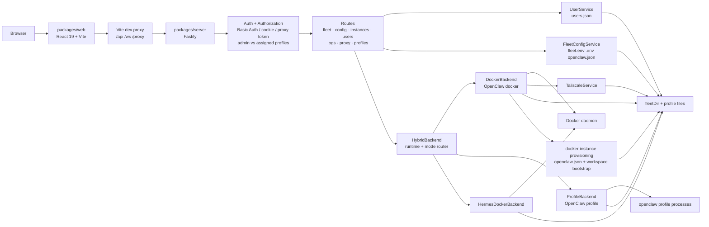

# Claw Fleet Manager Architecture

  <a href="README_CN.md"><strong>中文</strong></a>

## Overview

Claw Fleet Manager is a Turbo/npm-workspaces monorepo for operating `openclaw` and `hermes` gateway instances from a browser.

- `packages/server`: Fastify control plane with authentication, authorization, fleet APIs, WebSocket log streaming, and a reverse proxy for the embedded Control UI
- `packages/web`: React 19 + Vite dashboard backed by React Query and Zustand for fleet operations, config editing, plugin flows, and user administration

The server now models the fleet across two axes behind one shared API surface:

- `runtime`: `openclaw` or `hermes`
- `mode`: `profile` or `docker`

That yields three managed instance shapes in one fleet list:

- OpenClaw profile
- OpenClaw docker
- Hermes docker

## System Topology

## Request Flow

### Development

1. Browser loads the React app from Vite on `:5173`.
2. Vite proxies `/api/*`, `/ws/*`, and `/proxy/*` to the Fastify server on `https://localhost:3001`.
3. Fastify authenticates the request, applies route-level authorization, dispatches to the active backend, and returns JSON or WebSocket traffic.

### Production

If `packages/web/dist` exists, Fastify serves the built SPA directly with `@fastify/static`. Unknown non-API routes fall back to `index.html`, while `/api/*`, `/ws/*`, `/proxy/*`, and `/proxy-ws/*` still return normal API/proxy responses.

## Backend Bootstrap

`packages/server/src/index.ts` wires the runtime in this order:

1. Load `server.config.json` with Zod validation.
2. Optionally verify the `tailscale` CLI when `tailscale.hostname` is configured.
3. Optionally load TLS key/cert files and start Fastify in HTTPS mode.
4. Create shared services:
   - `FleetConfigService`
   - `UserService`
5. Bootstrap the first admin user from `config.auth` if `users.json` does not exist.
6. Construct runtime-specific backends:
   - `DockerBackend` for OpenClaw docker
   - `ProfileBackend` for OpenClaw profile
   - `HermesDockerBackend`
7. Wrap them in `HybridBackend`, which routes by `(runtime, mode)`.
8. Decorate Fastify with `backend`, `fleetConfig`, `fleetDir`, and `userService`.
9. Register auth, WebSocket support, management routes, legacy profile convenience routes, and static file serving.
10. Call `backend.initialize()` and begin listening on `0.0.0.0:{port}`.

## Authentication And Authorization

### Authentication

The global `onRequest` hook in [`packages/server/src/auth.ts`](../../packages/server/src/auth.ts) accepts these credential paths:

- HTTP API: `Authorization: Basic ...`
- WebSocket and proxy bootstrap: `?auth=<base64(username:password)>`
- Proxy cookie: `x-fleet-proxy-auth`
- Proxy-only HMAC token: `proxyToken=<expires.signature>`

Important implementation details:

- Password verification is delegated to `UserService`.
- Password hashes use `scrypt`.
- Unknown usernames still run a sentinel password check to reduce timing leakage.
- Proxy HMAC tokens are process-local, signed with a random secret, and expire after 24 hours.
- The proxy cookie is `HttpOnly`, `SameSite=Strict`, and scoped to `/proxy`.
- Browser Basic Auth prompts are suppressed for proxied Control UI traffic.

### Authorization

Authorization is split from authentication in [`packages/server/src/authorize.ts`](../../packages/server/src/authorize.ts):

- `requireAdmin`: only `admin` users may proceed
- `requireProfileAccess`: `admin` may access everything; `user` may access only instance IDs listed in `assignedProfiles`

`GET /api/fleet` also performs response-level filtering for non-admin users, so the sidebar only sees assigned instances.

## API Surface

The generated `/documentation` OpenAPI focuses on the typed management API under `/api/*`. Reverse-proxy transport routes under `/proxy/*` are intentionally excluded from that spec.

### Always Available Routes

| Route file | Endpoints | Notes |
|---|---|---|
| `health.ts` | `GET /api/health` | Basic liveness payload |
| `fleet.ts` | `GET /api/fleet`, `POST /api/fleet/instances`, `DELETE /api/fleet/instances/:id`, `POST /api/fleet/instances/:id/rename` | Hybrid fleet list plus create/remove/rename |
| `config.ts` | `GET/PUT /api/config/fleet`, `GET/PUT /api/fleet/:id/config` | Fleet config is admin-only; per-instance config requires profile access |
| `instances.ts` | start/stop/restart, token reveal, pending devices, device approval, Feishu pairing list/approve | Lifecycle is capability-gated; device + Feishu routes are OpenClaw-only |
| `migrate.ts` | `POST /api/fleet/instances/:id/migrate` | Admin-only OpenClaw migration between docker and profile |
| `users.ts` | current user, self password change, admin user CRUD/reset/instance assignment | User bootstrap and password rotation live here |
| `sessions.ts` | `GET /api/fleet/sessions` | Admin-only session aggregation across running instances with session support |
| `logs.ts` | `WS /ws/logs/:id`, `WS /ws/logs` | Per-instance logs for assigned users, all logs for admins |
| `proxy.ts` | `/proxy/:id`, `/proxy/*`, matching WS upgrade path | Reverse proxy for the embedded Control UI |
| `plugins.ts` | `GET /api/fleet/:id/plugins`, `POST /api/fleet/:id/plugins/install`, `DELETE /api/fleet/:id/plugins/:pluginId` | Available only when `runtimeCapabilities.plugins` is true |
| `profiles.ts` | `GET/POST /api/fleet/profiles`, `DELETE /api/fleet/profiles/:name` | Legacy admin convenience routes for OpenClaw profile create/list/delete; always registered |

## Deployment Backend Abstraction

`packages/server/src/services/backend.ts` defines the shared `DeploymentBackend` interface. Routes call this interface rather than speaking directly to Docker or profile-process code.

`packages/server/src/services/hybrid-backend.ts` is now the runtime-aware router. It dispatches create, lifecycle, config, logs, rename, remove, and migration operations to the correct backend based on the instance runtime and mode.

### DockerBackend

[`packages/server/src/services/docker-backend.ts`](../../packages/server/src/services/docker-backend.ts) is responsible for:

- polling Docker every 5 seconds and caching `FleetStatus`
- mapping managed containers onto fleet instance IDs, gateway ports, and internal indexes
- starting, stopping, restarting, creating, renaming, and removing containers
- reading tokens and instance config via `FleetConfigService`
- provisioning new instances through `docker-instance-provisioning`
- creating managed containers directly through `DockerService`
- tailing container logs through Docker’s multiplexed log stream
- optionally allocating and restoring Tailscale HTTPS serve rules

Operational characteristics:

- OpenClaw Docker instances use managed names such as `team-alpha`; if no name is supplied, the backend falls back to `openclaw-N`
- each instance still gets an internal numeric index used for token storage, port derivation, and optional Tailscale port allocation
- create/remove is instance-centric: allocate token + workspace state, then create or delete one container
- there is no fleet-wide scale API and no `docker-compose.yml` reconciliation layer
- disk figures come from both filesystem traversal and best-effort Docker volume usage

### ProfileBackend

[`packages/server/src/services/profile-backend.ts`](../../packages/server/src/services/profile-backend.ts) is responsible for:

- storing profile metadata in `profiles.json`
- creating profiles with `openclaw --profile <name> setup`
- assigning or auto-allocating ports
- starting native gateway processes with profile-specific env vars
- adopting already-running healthy gateways on restart
- polling profile health every 5 seconds
- collecting process CPU/RSS via `ps`
- streaming logs from `fleetDir/logs/<profile>.log`
- handling plugin management and other instance commands by shelling out to the `openclaw` binary

Operational characteristics:

- instance IDs are managed profile names such as `team-alpha`
- each profile has:
  - a config file under `profiles.configBaseDir/<name>/openclaw.json`
  - a state directory under `profiles.stateBaseDir/<name>`
  - a workspace under `<stateDir>/workspace`
- workspace bootstrap seeds `.gitignore`, `CLAUDE.md`, and `MEMORY.md`
- `autoRestart` only applies in profile mode
- native processes are left running across server shutdown and re-adopted later

### HermesDockerBackend

[`packages/server/src/services/hermes-docker-backend.ts`](../../packages/server/src/services/hermes-docker-backend.ts) manages Hermes gateway containers with per-instance persistent homes mounted into the container.

Operational characteristics:

- containers are labeled as Hermes runtime instances and filtered separately from OpenClaw docker instances
- Hermes docker uses the runtime image configured in `server.config.json`
- Hermes docker exposes gateway-first capabilities: lifecycle, logs, delete/rename, and config editing
- OpenClaw-only capabilities remain gated off in the API and web UI

## Supporting Services

### FleetConfigService

[`packages/server/src/services/fleet-config.ts`](../../packages/server/src/services/fleet-config.ts) manages Docker-mode fleet files:

- `config/fleet.env`
- `.env` for `TOKEN_N=...`
- per-instance `openclaw.json`

It also:

- ensures Docker config/workspace base directories exist before writes
- masks tokens before returning them to the UI
- performs atomic writes via `*.tmp` + rename

### UserService

[`packages/server/src/services/user.ts`](../../packages/server/src/services/user.ts) manages `users.json` in `fleetDir`.

Capabilities:

- bootstrap first admin account
- verify credentials
- create/delete users
- reset passwords
- self-service password change
- assign per-instance access lists

### DockerService

[`packages/server/src/services/docker.ts`](../../packages/server/src/services/docker.ts) is the Docker-mode runtime adapter built on Dockerode.

It is responsible for:

- listing managed `openclaw-N` containers
- creating one container at a time with fixed naming, port bindings, and restart policy
- applying resource limits from `fleet.env` such as CPU and memory
- mounting per-instance config, workspace, and optional `.npm` cache directories
- configuring hardening options like `read_only`, `tmpfs`, `cap_drop: ALL`, and `no-new-privileges`
- attaching a health check that probes `http://127.0.0.1:18789/healthz`

### Docker Instance Provisioning

[`packages/server/src/services/docker-instance-provisioning.ts`](../../packages/server/src/services/docker-instance-provisioning.ts) prepares Docker-mode instance state before the container starts.

It:

- creates per-instance config and workspace directories
- writes a default `openclaw.json` when one does not already exist
- seeds workspace helper files such as `.gitignore`, `CLAUDE.md`, and `MEMORY.md`
- merges model/provider settings from fleet config into the generated gateway config
- optionally adds Tailscale allowed origins and preserves user-edited config files by skipping overwrite when `openclaw.json` already exists

### TailscaleService

[`packages/server/src/services/tailscale.ts`](../../packages/server/src/services/tailscale.ts) is optional and used by OpenClaw Docker instances when configured.

It:

- persists a `tailscale-ports.json` map under `fleetDir`
- allocates HTTPS ports starting at `8800`
- runs `tailscale serve`
- restores missing serve rules on startup
- exposes per-instance public URLs back into fleet status

## Reverse Proxy And Control UI

The reverse proxy in [`packages/server/src/routes/proxy.ts`](../../packages/server/src/routes/proxy.ts) exists so the Control UI can still work remotely when the browser cannot talk directly to the gateway port.

Key behaviors:

- forwards HTTP requests to `http://127.0.0.1:{instance.port}`
- forwards WebSocket traffic while preserving binary/text frame type
- strips hop-by-hop headers, upstream CSP, and `X-Frame-Options`
- redirects `/proxy/:id` to `/proxy/:id/`
- injects a bootstrap script into proxied HTML pages

The injected script:

- stores the gateway token in `sessionStorage`
- writes the proxied gateway URL into `localStorage`
- wraps `window.WebSocket` to append `proxyToken`
- lets the upstream UI read the token from expected storage keys

This is what allows the frontend `ControlUiTab` to use `/proxy/:id/` when accessed from a remote host without a direct Tailscale URL.

## Frontend Architecture

### State And Data Fetching

- React Query handles server synchronization
- Zustand stores UI state:
  - selected view (`instance`, `instances`, `dashboard`, `runningSessions`, `sessions`, `users`, `config`, or `account`)
  - active tab
  - current user snapshot

The main queries are:

- `useCurrentUser`
- `useFleet`
- `useFleetConfig`
- `useInstanceConfig`
- `useUsers`
- `useLogs` for WebSocket log streaming

### Layout

The top-level shell is:

- [`Shell.tsx`](../../packages/web/src/components/layout/Shell.tsx)
  - renders the account button and current main panel
- [`Sidebar.tsx`](../../packages/web/src/components/layout/Sidebar.tsx)
  - lists visible instances
  - shows admin navigation
  - opens the add-profile dialog in profile mode

Main views:

- fleet dashboard panel (`dashboard`) — fleet-wide session overview with status summary and activity board
- instance management panel (`instances`) — create, rename, and delete instances
- instance panel (`instance`) — per-instance tabs
- running sessions panel (`runningSessions`) — live monitor of active sessions
- sessions panel (`sessions`) — historical session table with filtering and sorting
- user management panel (`users`) — user CRUD and instance assignment
- fleet config panel (`config`) — global fleet settings
- account panel (`account`) — non-admin self-service home

### Instance Panel Tabs

[`packages/web/src/components/instances/InstancePanel.tsx`](../../packages/web/src/components/instances/InstancePanel.tsx) keeps `OverviewTab` eager and lazy-loads the heavier tabs:

- `InstanceActivityTab`
- `LogsTab`
- `ConfigTab`
- `MetricsTab`
- `ControlUiTab`
- `FeishuTab`
- `PluginsTab`

### Frontend Auth Model

The web app sends Basic Auth on normal API requests using credentials from `packages/web/.env.local`.

For WebSockets, `useLogs` appends `?auth=<base64(username:password)>`, which the server converts into the proxy cookie flow used for subsequent proxied requests.

## Persisted Files

### Under `fleetDir`

- `users.json`: user database
- `profiles.json`: profile registry in profile mode
- `tailscale-ports.json`: optional Docker-mode Tailscale port map
- `logs/<profile>.log`: profile-mode log files
- `.env`: Docker-mode gateway tokens
- `config/fleet.env`: Docker-mode fleet config

### Outside `fleetDir` In Profile Mode

- `profiles.configBaseDir/<name>/openclaw.json`
- `profiles.stateBaseDir/<name>/...`
- `profiles.stateBaseDir/<name>/workspace`

## Validation Rules

[`packages/server/src/validate.ts`](../../packages/server/src/validate.ts) enforces mode-specific instance IDs:

- Docker mode: `openclaw-\d+`
- Profile mode: lowercase alphanumeric plus hyphen, and explicitly not Docker-style IDs

Additional route-local validation covers:

- user names
- profile names
- UUID device approval IDs
- Feishu pairing codes
- plugin IDs
- JSON body schemas with Zod

## Testing Coverage

The server has route and service tests under [`packages/server/tests`](../../packages/server/tests), including:

- auth and authorization flows
- fleet/config/instance routes
- users and profile routes
- plugin routes
- proxy behavior
- Docker/Profile backend services
- Docker instance provisioning
- tailscale integration logic
