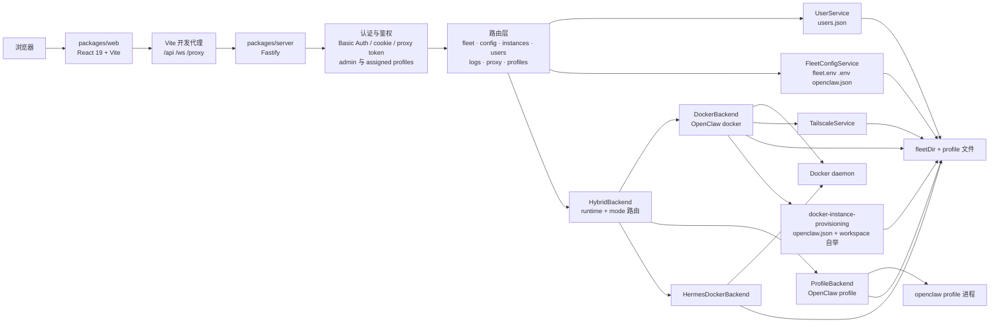

# Claw Fleet Manager 架构文档

  <a href="README.md"><strong>English</strong></a>

## 概览

Claw Fleet Manager 是一个基于 Turbo 和 npm workspaces 的 monorepo，用于在浏览器中管理 `openclaw` 与 `hermes` 网关实例。

- `packages/server`：基于 Fastify 的控制平面，负责认证、鉴权、集群 API、WebSocket 日志流，以及嵌入式 Control UI 的反向代理
- `packages/web`：基于 React 19 + Vite 的管理面板，使用 React Query 和 Zustand 实现实例操作、配置编辑、插件流程和用户管理

服务端现在在统一 API 之下按两个维度建模实例：

- `runtime`：`openclaw` 或 `hermes`
- `mode`：`profile` 或 `docker`

因此在同一个实例列表中会出现三种受管实例：

- OpenClaw profile
- OpenClaw docker
- Hermes docker

## 系统拓扑

## 请求流

### 开发环境

1. 浏览器从 `:5173` 的 Vite 加载 React 应用。
2. Vite 将 `/api/*`、`/ws/*` 和 `/proxy/*` 代理到 `https://localhost:3001` 的 Fastify 服务。
3. Fastify 完成认证、路由级鉴权、后端调度，然后返回 JSON 或 WebSocket 数据。

### 生产环境

如果 `packages/web/dist` 存在，Fastify 会通过 `@fastify/static` 直接托管构建后的 SPA。未知的非 API 路由会回退到 `index.html`，而 `/api/*`、`/ws/*`、`/proxy/*` 和 `/proxy-ws/*` 仍保持 API/代理行为。

## 服务端启动流程

`packages/server/src/index.ts` 的启动顺序如下：

1. 使用 Zod 加载并校验 `server.config.json`
2. 在 Docker 模式且配置了 `tailscale.hostname` 时，检查本机是否存在 `tailscale` CLI
3. 如配置了 TLS，则加载 key/cert 并以 HTTPS 模式启动 Fastify
4. 创建共享服务：
   - `FleetConfigService`
   - `UserService`
5. 如果 `users.json` 不存在，则用 `config.auth` 初始化第一个管理员账号
6. 创建各个运行时后端：
   - OpenClaw docker 的 `DockerBackend`
   - OpenClaw profile 的 `ProfileBackend`
   - `HermesDockerBackend`
7. 用 `HybridBackend` 将它们组合起来，并按 `(runtime, mode)` 路由
8. 通过 Fastify decorator 注入 `backend`、`deploymentMode`、`fleetConfig`、`fleetDir` 和 `userService`
9. 注册认证、WebSocket、各类路由以及静态资源托管
10. 调用 `backend.initialize()` 并监听 `0.0.0.0:{port}`

## 认证与权限控制

### 认证

全局 `onRequest` hook 位于 [`packages/server/src/auth.ts`](../../packages/server/src/auth.ts)，支持以下凭证入口：

- HTTP API：`Authorization: Basic ...`
- WebSocket 与代理启动：`?auth=<base64(username:password)>`
- 代理 cookie：`x-fleet-proxy-auth`
- 仅代理使用的 HMAC token：`proxyToken=<expires.signature>`

关键实现细节：

- 密码校验由 `UserService` 执行
- 密码哈希使用 `scrypt`
- 对不存在的用户名仍会执行一次哨兵密码校验，以降低时序泄漏
- 代理 HMAC token 为进程内随机密钥签名，24 小时过期
- 代理 cookie 为 `HttpOnly`、`SameSite=Strict`，路径限定在 `/proxy`
- 对代理 Control UI 流量不会触发浏览器 Basic Auth 弹窗

### 权限控制

鉴权逻辑与认证分离，定义在 [`packages/server/src/authorize.ts`](../../packages/server/src/authorize.ts)：

- `requireAdmin`：仅 `admin` 用户可访问
- `requireProfileAccess`：`admin` 可访问全部实例；`user` 仅可访问自己 `assignedProfiles` 中列出的实例

`GET /api/fleet` 还会在响应阶段对普通用户进行实例过滤，因此侧边栏只能看到其被授权的实例。

## API 结构

### 所有模式都存在的路由

| 路由文件 | 端点 | 说明 |
|---|---|---|
| `health.ts` | `GET /api/health` | 基础健康检查 |
| `fleet.ts` | `GET /api/fleet`、`POST /api/fleet/scale` | scale 仅管理员可用，且只支持 Docker 模式 |
| `config.ts` | `GET/PUT /api/config/fleet`、`GET/PUT /api/fleet/:id/config` | fleet 配置仅管理员可用；实例配置要求具备实例访问权限 |
| `instances.ts` | 启停重启、token 查看、待审批设备、设备审批、飞书配对列表/审批 | 在调用后端前先校验实例 ID 和配对参数 |
| `users.ts` | 当前用户、自助改密、管理员用户 CRUD/重置密码/profile 分配 | 用户体系核心都在这里 |
| `logs.ts` | `WS /ws/logs/:id`、`WS /ws/logs` | 普通用户看单实例日志，管理员可看全局日志 |
| `proxy.ts` | `/proxy/:id`、`/proxy/*` 及对应 WS | 嵌入式 Control UI 的反向代理 |
| `plugins.ts` | `GET /api/fleet/:id/plugins`、`POST /api/fleet/:id/plugins/install`、`DELETE /api/fleet/:id/plugins/:pluginId` | 两种模式都可用；底层统一走 `execInstanceCommand()` |

### 仅 Profile 模式注册的路由

只有在 `deploymentMode === 'profiles'` 时才会注册：

- `GET /api/fleet/profiles`
- `POST /api/fleet/profiles`
- `DELETE /api/fleet/profiles/:name`

## DeploymentBackend 抽象

`packages/server/src/services/backend.ts` 定义了统一的 `DeploymentBackend` 接口。路由层始终依赖这一抽象，而不是直接依赖 Docker 或 profile 进程实现。

`packages/server/src/services/hybrid-backend.ts` 现在是运行时感知的路由器，会根据实例的 `(runtime, mode)` 将创建、生命周期、配置、日志、重命名、删除以及迁移请求分发到对应后端。

### DockerBackend

[`packages/server/src/services/docker-backend.ts`](../../packages/server/src/services/docker-backend.ts) 负责：

- 每 5 秒轮询 Docker 并缓存 `FleetStatus`
- 将 `openclaw-3` 这样的容器名映射为实例 ID 和网关端口
- 启动、停止、重启和扩缩容容器
- 借助 `FleetConfigService` 读取 token 与实例配置
- 通过 `docker-instance-provisioning` 完成新实例文件自举
- 通过 `DockerService` 直接创建受管容器
- 通过 Docker 的 multiplexed log stream 实时读取日志
- 可选地分配并恢复 Tailscale HTTPS serve 规则

运行特性：

- 实例 ID 格式为 `openclaw-N`
- 扩容/创建以单实例为原语：分配 token、写入文件、创建一个容器
- 缩容时会优先停止编号更大的容器
- 不再依赖 `docker-compose.yml` 做状态收敛
- 为了保持编号连续，`removeInstance()` 目前只允许删除编号最大的实例
- 磁盘占用来自文件系统遍历，并辅以 Docker volume 使用量的 best-effort 覆盖

### ProfileBackend

[`packages/server/src/services/profile-backend.ts`](../../packages/server/src/services/profile-backend.ts) 负责：

- 将 profile 元数据持久化到 `profiles.json`
- 通过 `openclaw --profile <name> setup` 创建 profile
- 分配或自动探测端口
- 使用 profile 专属环境变量启动原生 gateway 进程
- 在服务重启后接管已存在且健康的 gateway 进程
- 每 5 秒轮询 profile 健康状态
- 通过 `ps` 采集进程 CPU 和 RSS
- 从 `fleetDir/logs/<profile>.log` 读取日志
- 通过调用 `openclaw` CLI 执行插件管理和其他实例级命令

运行特性：

- 实例 ID 是 profile 名，例如 `main`，而不是 `openclaw-N`
- 每个 profile 都有：
  - `profiles.configBaseDir/<name>/openclaw.json`
  - `profiles.stateBaseDir/<name>`
  - `<stateDir>/workspace`
- workspace 初始化时会自动写入 `.gitignore`、`CLAUDE.md` 和 `MEMORY.md`
- `autoRestart` 仅作用于 profile 模式
- 服务端退出时不会主动关闭 profile 进程，后续会重新接管

### HermesDockerBackend

[`packages/server/src/services/hermes-docker-backend.ts`](../../packages/server/src/services/hermes-docker-backend.ts) 负责管理 Hermes 网关容器，并为每个实例挂载持久化 home 目录。

运行特性：

- 容器会打上 Hermes 运行时标签，并与 OpenClaw docker 实例分开识别
- Hermes docker 使用 `server.config.json` 中配置的运行时镜像
- Hermes docker 当前支持的仍是 gateway-first 能力：生命周期、日志、删除/重命名和配置编辑
- OpenClaw 专属能力会在 API 和前端中显式隐藏

## 支撑服务

### FleetConfigService

[`packages/server/src/services/fleet-config.ts`](../../packages/server/src/services/fleet-config.ts) 管理 Docker 模式下的 fleet 文件：

- `config/fleet.env`
- `.env` 中的 `TOKEN_N=...`
- 每个实例的 `openclaw.json`

它还负责：

- 在写入前确保 Docker 模式的 config/workspace 基础目录存在
- 从 `COUNT` 或持久化的 `TOKEN_N` 数量推导 `count`
- 将 token 脱敏后返回给前端
- 通过 `*.tmp` + rename 完成原子写入

### UserService

[`packages/server/src/services/user.ts`](../../packages/server/src/services/user.ts) 管理 `fleetDir` 下的 `users.json`。

能力包括：

- 初始化首个管理员账号
- 校验登录凭证
- 创建/删除用户
- 重置密码
- 自助修改密码
- 分配每个用户可访问的 profile 列表

### DockerService

[`packages/server/src/services/docker.ts`](../../packages/server/src/services/docker.ts) 是 Docker 模式的运行时适配层，基于 Dockerode。

它负责：

- 列出受管的 `openclaw-N` 容器
- 以单实例为单位创建容器，并设置固定命名、端口映射和重启策略
- 应用来自 `fleet.env` 的 CPU / 内存限制
- 挂载每实例的 config、workspace，以及可选的 `.npm` 缓存目录
- 配置 `read_only`、`tmpfs`、`cap_drop: ALL`、`no-new-privileges` 等加固选项
- 添加指向 `http://127.0.0.1:18789/healthz` 的健康检查

### Docker 实例自举

[`packages/server/src/services/docker-instance-provisioning.ts`](../../packages/server/src/services/docker-instance-provisioning.ts) 会在容器启动前准备 Docker 模式实例所需的文件状态。

它会：

- 创建每实例的 config 和 workspace 目录
- 在 `openclaw.json` 不存在时写入默认配置
- 写入 `.gitignore`、`CLAUDE.md`、`MEMORY.md` 等 workspace 辅助文件
- 将 fleet 级模型/provider 设置合并进生成的网关配置
- 在需要时加入 Tailscale allowed origins，并在 `openclaw.json` 已存在时跳过覆盖，以保留用户手工修改

### TailscaleService

[`packages/server/src/services/tailscale.ts`](../../packages/server/src/services/tailscale.ts) 是可选的，并且只在 Docker 模式下使用。

它会：

- 在 `fleetDir` 下持久化 `tailscale-ports.json`
- 从 `8800` 开始分配 HTTPS 端口
- 调用 `tailscale serve`
- 在启动时恢复缺失的 serve 规则
- 将每个实例的公开 URL 回填到 fleet 状态

## 反向代理与 Control UI

[`packages/server/src/routes/proxy.ts`](../../packages/server/src/routes/proxy.ts) 提供了反向代理能力，用于在浏览器无法直接访问实例网关端口时，仍能远程使用 Control UI。

关键行为：

- 将 HTTP 请求转发到 `http://127.0.0.1:{instance.port}`
- 转发 WebSocket，并保留二进制/文本帧类型
- 清理 hop-by-hop header、上游 CSP 以及 `X-Frame-Options`
- 将 `/proxy/:id` 重定向到 `/proxy/:id/`
- 在被代理的 HTML 页面中注入启动脚本

注入脚本会：

- 将 gateway token 写入 `sessionStorage`
- 将代理后的 gateway URL 写入 `localStorage`
- 包装 `window.WebSocket`，自动附加 `proxyToken`
- 让上游 UI 能从预期的 storage key 中读到 token

这也是为什么前端 `ControlUiTab` 在远程访问、且没有 Tailscale URL 时，会回退到 `/proxy/:id/`。

## 前端架构

### 状态与数据同步

- React Query 负责和服务端同步数据
- Zustand 负责 UI 状态：
  - 当前视图（`instance`、`instances`、`dashboard`、`runningSessions`、`sessions`、`users`、`config` 或 `account`）
  - 当前 tab
  - 当前用户快照

主要 query / hook 包括：

- `useCurrentUser`
- `useFleet`
- `useFleetConfig`
- `useInstanceConfig`
- `useUsers`
- `useLogs`，用于 WebSocket 日志流

### 布局结构

顶层 UI 结构：

- [`Shell.tsx`](../../packages/web/src/components/layout/Shell.tsx)
  - 渲染账户按钮和主内容区域
- [`Sidebar.tsx`](../../packages/web/src/components/layout/Sidebar.tsx)
  - 展示当前可见实例
  - 展示管理员导航
  - 在 profile 模式下打开新增 profile 对话框

主视图包括：

- 舰队仪表盘面板（`dashboard`）——全舰队会话总览，含状态汇总和活动看板
- 实例管理面板（`instances`）——创建、重命名和删除实例
- 实例详情面板（`instance`）——含各实例 tab
- 运行中会话面板（`runningSessions`）——实时监控活跃会话
- 会话管理面板（`sessions`）——含筛选和排序的历史会话表格
- 用户管理面板（`users`）——用户增删改查及 profile 分配
- fleet 配置面板（`config`）——全局舰队设置
- 账户面板（`account`）——非管理员自助主页

### 实例详情页 Tab

[`packages/web/src/components/instances/InstancePanel.tsx`](../../packages/web/src/components/instances/InstancePanel.tsx) 会保留 `OverviewTab` 为同步加载，并延迟加载更重的 tab：

- `InstanceActivityTab`
- `LogsTab`
- `ConfigTab`
- `MetricsTab`
- `ControlUiTab`
- `FeishuTab`
- `PluginsTab`

### 前端认证模型

前端普通 API 请求会通过 `packages/web/.env.local` 中的凭证自动附加 Basic Auth。

对于 WebSocket，`useLogs` 会附加 `?auth=<base64(username:password)>`，服务端再据此建立后续代理流程所需的 cookie 认证状态。

## 持久化文件

### `fleetDir` 下的文件

- `users.json`：用户数据库
- `profiles.json`：profile 模式下的实例注册表
- `tailscale-ports.json`：Docker 模式下可选的 Tailscale 端口映射
- `logs/<profile>.log`：profile 模式日志文件
- `.env`：Docker 模式网关 token
- `config/fleet.env`：Docker 模式 fleet 配置

### Profile 模式下位于 `fleetDir` 外的文件

- `profiles.configBaseDir/<name>/openclaw.json`
- `profiles.stateBaseDir/<name>/...`
- `profiles.stateBaseDir/<name>/workspace`

## 校验规则

[`packages/server/src/validate.ts`](../../packages/server/src/validate.ts) 为不同模式定义了不同的实例 ID 规则：

- Docker 模式：`openclaw-\d+`
- Profile 模式：小写字母数字加连字符，并且显式拒绝 Docker 风格 ID

此外，路由层还会校验：

- 用户名
- profile 名称
- 设备审批使用的 UUID
- 飞书配对码
- 插件 ID
- 各类 Zod JSON body schema

## 测试覆盖

服务端在 [`packages/server/tests`](../../packages/server/tests) 下包含路由和服务测试，覆盖内容包括：

- 认证与鉴权流程
- fleet/config/instance 路由
- users 与 profiles 路由
- plugin 路由
- proxy 行为
- Docker/Profile 后端服务
- Docker 实例自举
- tailscale 集成逻辑
