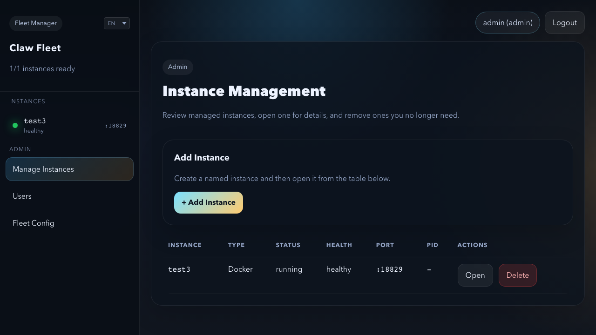
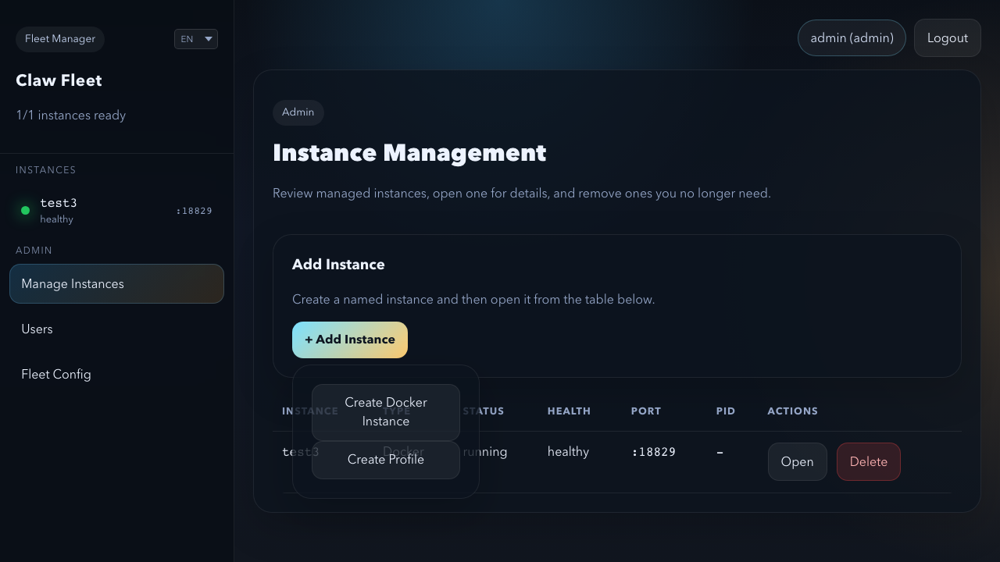
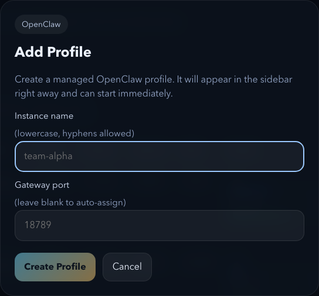
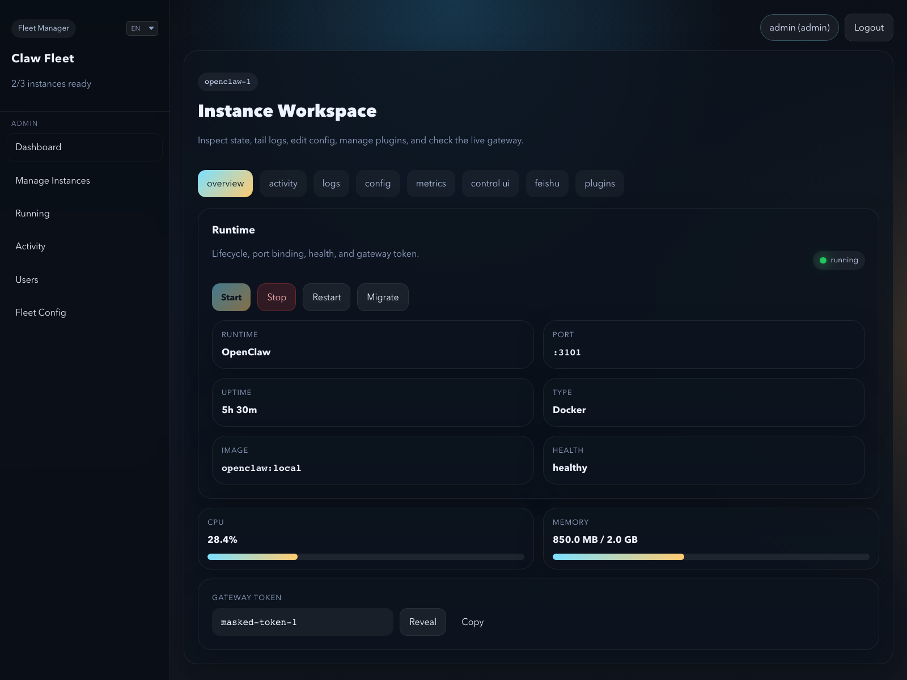
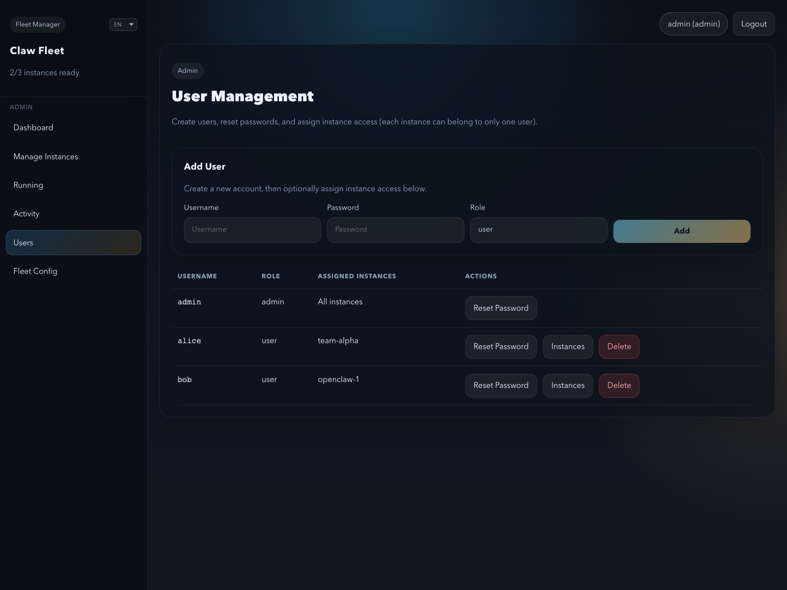
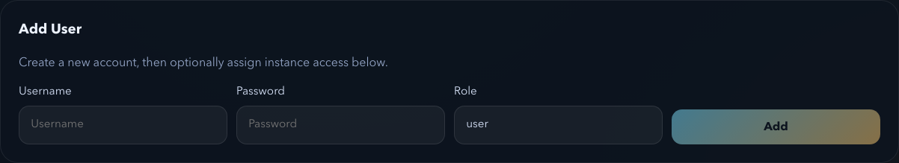
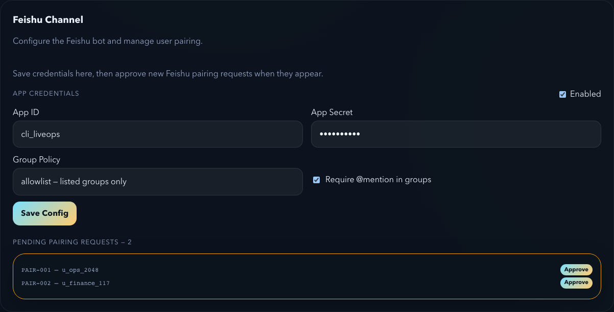
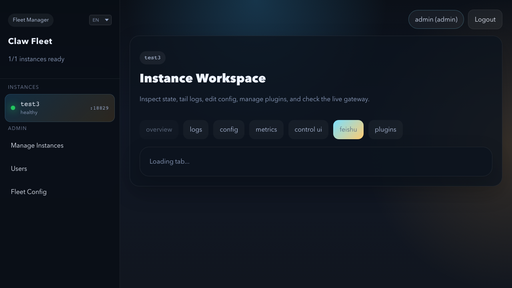

# Claw Fleet Manager — Administrator Guide (Profile Mode)

This guide covers day-to-day admin workflows for **Claw Fleet Manager** running in Profile mode.
Each section is self-contained — jump directly to the task you need.

> **Prerequisites:** You are logged in as an admin user. The server is running and accessible in your browser.

---

## Table of Contents

- [0. Dashboard Orientation](#0-dashboard-orientation)
- [1. Create a New Instance](#1-create-a-new-instance)
- [2. Start / Stop / Restart an Instance](#2-start--stop--restart-an-instance)
- [3. Manage Users](#3-manage-users)
- [4. Approve a Device](#4-approve-a-device)
- [5. Feishu Pairing](#5-feishu-pairing)
- [6. View Logs and Monitor Health](#6-view-logs-and-monitor-health)
- [7. Install or Remove a Plugin](#7-install-or-remove-a-plugin)
- [8. Edit Instance Configuration](#8-edit-instance-configuration)

---

## 0. Dashboard Orientation

When you open Claw Fleet Manager in your browser you see three areas.

**Sidebar (left column)**

| Element | What it does |
|---------|-------------|
| Instance list | One button per profile instance — click to open it |
| Manage Instances | Create or delete instances |
| Users | Create and manage user accounts |
| Fleet Config | Global fleet settings |

**Main panel (centre)**

Shows details for the selected instance or admin panel.

**Tab row (top of main panel)**

When an instance is selected, the tab row gives you: Overview · Logs · Config · Metrics · Control UI · Feishu · Plugins

> **Note:** Non-admin users only see the instances assigned to them and do not see the Users or Fleet Config buttons.

---

## 1. Create a New Instance

Use this when you need to add a new profile gateway to the fleet.

**Steps:**

1. In the sidebar, click **Manage Instances** (under the Admin section).

   

2. Click **Add Instance**.

   

3. From the dropdown that appears, click **Create Profile Instance**.

4. In the dialog that opens, enter a name for the instance.

   

   > **Name rules:** lowercase letters, numbers, and hyphens only (e.g. `team-a`, `dev-1`). The name `main` is reserved — do not use it.

5. Optionally enter a **Gateway Port** if you need a specific port. Leave it blank to let the system assign one automatically.

6. Click **Create Profile Instance**.

7. The new instance appears in the sidebar. Click its name to open it.

> **After creating:** The instance starts in a stopped state. Go to [Section 2](#2-start--stop--restart-an-instance) to start it.

---

## 2. Start / Stop / Restart an Instance

Use this to control whether an instance is running.

**Steps:**

1. Click the instance name in the sidebar.

2. Make sure you are on the **Overview** tab (it is selected by default).

   

3. Click the action you need:

   | Button | When to use | Enabled when |
   |--------|-------------|--------------|
   | **Start** | Launch a stopped instance | Instance is stopped |
   | **Stop** | Shut down a running instance | Instance is running |
   | **Restart** | Stop then immediately start | Instance is running |

4. The **status badge** in the top-right of the panel updates to `running` or `stopped`.

> **Tip:** After editing an instance's configuration (Section 8), use **Restart** for the changes to take effect.

---

## 3. Manage Users

Use this to create accounts, control which instances a user can access, and reset passwords.

### 3a. Open User Management

Click **Users** in the sidebar (under the Admin section).

The Users panel lists all accounts.

---

### 3b. Create a User

1. Click **Add User**.

   

2. Enter a **username** and **initial password**.

3. Set the **role**:
   - **Admin** — full access to all instances and admin panels
   - **User** — access only to instances you assign to them

4. Click **Create**.

---

### 3c. Assign Instances to a User

Users with the **User** role can only access instances listed in their profile assignment.

1. Find the user in the table and click **Edit** (or the assignment control next to their name).
2. Select which profile instances this user may access.
3. Click **Save**.

---

### 3d. Reset a Password

1. Find the user in the table and click **Reset Password**.
2. Enter the new password and confirm it.
3. Click **Reset**.

> **Note:** Users can change their own password from the My Account panel.

---

## 4. Approve a Device

Use this when a user's browser or client is waiting for approval to connect to an instance's Control UI.

**Steps:**

1. Click the instance name in the sidebar.

2. Click the **Control UI** tab.

3. If there are pending devices, a yellow card shows the count and each device's IP address and request ID.

   

4. Click **Approve** next to a specific device to approve it individually, or click **Approve All** to approve all at once.

5. Approved devices disappear from the list immediately.

> **No pending devices?** If the card does not appear, there are no devices waiting for approval at this time.

---

## 5. Feishu Pairing

Use this to connect an instance to a Feishu (Lark) bot channel and approve user pairing requests.

### 5a. Configure Feishu credentials

You only need to do this once per instance (or when credentials change).

1. Click the instance name in the sidebar → **Feishu** tab.

   

2. Enter the **App ID** and **App Secret** from your Feishu developer console (e.g. `cli_xxx` and the corresponding secret).

3. Set **Group Policy**:
   - **Open** — any group the bot is added to can use it
   - **Allowlist** — only approved groups
   - **Disabled** — groups cannot use the bot

4. Check or uncheck **Require Mention** — when checked, users must @mention the bot to get a response.

5. Click **Save Config**.

6. Go to the **Overview** tab and click **Restart** for the credentials to take effect.

---

### 5b. Approve a Feishu pairing request

When a Feishu user sends the pairing command to the bot, their code appears here.

1. Click the instance → **Feishu** tab.

2. In the **Pending Pairing Requests** section, find the pairing code for the user.

   

3. Click **Approve** next to the code.

> **No pending requests?** The section shows "No pending pairing requests." — the user either hasn't sent the command yet or the bot isn't running (check that the instance is started and Feishu credentials are saved).

---
