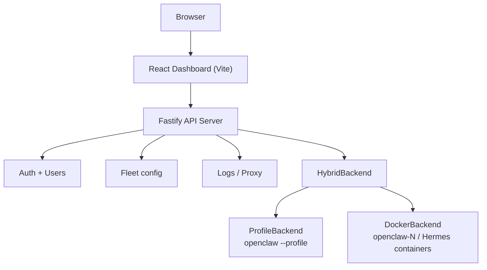

# README Refinement Implementation Plan

> **For agentic workers:** REQUIRED SUB-SKILL: Use superpowers:subagent-driven-development (recommended) or superpowers:executing-plans to implement this plan task-by-task. Steps use checkbox (`- [ ]`) syntax for tracking.

**Goal:** Refine README.md for clarity, structure, and visual polish while moving detailed setup instructions to dedicated guide files.

**Architecture:** Two files change — `README.md` is rewritten in-place section by section, and a new `docs/guides/docker-deployment.md` receives all Docker deployment detail moved out of the README. The existing `docs/guides/installation-guide.md` already covers the full Quick Start detail and needs no changes.

**Tech Stack:** Markdown, Mermaid (renders natively on GitHub), existing screenshot assets in `docs/guides/screenshots/`

---

## File Map

| File | Action | Responsibility |
|---|---|---|
| `docs/guides/docker-deployment.md` | **Create** | Full Docker deployment reference (moved from README) |
| `README.md` | **Modify** | Rewrite per spec: merged intro, trimmed Quick Start, trimmed Docker, 2×3 screenshot gallery, Mermaid architecture |

---

### Task 1: Create `docs/guides/docker-deployment.md`

**Files:**
- Create: `docs/guides/docker-deployment.md`

- [ ] **Step 1: Create the Docker deployment guide**

Write `docs/guides/docker-deployment.md` with the following exact content:

```markdown
# Claw Fleet Manager — Docker Deployment

Use this when you want the fleet manager itself to run in Docker and manage Docker-backed OpenClaw instances through the host Docker daemon.

## Quick Start

```bash
chmod +x scripts/docker-deploy.sh
./scripts/docker-deploy.sh
```

Default result:

| Default | Value |
|---|---|
| Manager URL | `http://localhost:3001` |
| Admin login | `admin` / `changeme` |
| Data root | `.docker-data/claw-fleet-manager` |

## Constraints

- This deployment is for **Docker-backed instances only**.
- It mounts `/var/run/docker.sock`, so the manager controls the host Docker daemon.
- The script mounts the data directory at the **same absolute host path** inside the container, which is required for Docker bind mounts created by the manager to work correctly.
- The default OpenClaw image for new managed instances is `openclaw:local`.

## Overrides

```bash
ADMIN_USER=ops \
ADMIN_PASSWORD='change-this-now' \
MANAGER_PORT=3002 \
OPENCLAW_IMAGE=ghcr.io/your-org/openclaw:latest \
./scripts/docker-deploy.sh
```

## TLS

To enable the embedded Control UI over HTTPS, pass existing cert files:

```bash
TLS_CERT=/abs/path/cert.pem TLS_KEY=/abs/path/key.pem ./scripts/docker-deploy.sh
```

Cert paths outside the data root are mounted read-only automatically.

## Provider Defaults for New Docker Instances

Set default API credentials for newly created Docker instances:

```bash
BASE_URL=https://api.openai.com/v1 \
MODEL_ID=gpt-5-mini \
API_KEY=sk-... \
./scripts/docker-deploy.sh
```

## Managing the Deployment

```bash
docker rm -f claw-fleet-manager        # stop and remove
docker logs -f claw-fleet-manager      # follow logs
```
```

- [ ] **Step 2: Commit**

```bash
git add docs/guides/docker-deployment.md
git commit -m "docs: add Docker deployment guide"
```

---

### Task 2: Rewrite README — header, intro, capability table

**Files:**
- Modify: `README.md`

This task replaces the top of the README through the capability table. The changes are:
- Add `Docker Deployment` to the nav link bar
- Merge the two intro paragraphs and "Why this project exists" into one tighter block
- Remove the standalone **Hermes gateway support** section
- Add a one-line Hermes note below the capability table

- [ ] **Step 1: Replace the README from the top through the end of the capability table**

Replace the entire README from line 1 through the end of the `## Hermes gateway support` section (currently ends around line 80) with:

```markdown
# Claw Fleet Manager

<p align="center">
  <a href="README_CN.md"><strong>简体中文</strong></a>
</p>

<p align="center">
  <strong>Manage an OpenClaw and Hermes fleet from the browser.</strong><br/>
  Start, stop, configure, and monitor OpenClaw profile instances plus OpenClaw and Hermes Docker gateway instances from one dashboard.
</p>

<p align="center">
  
  
  
  
</p>

<p align="center">
  <a href="README_CN.md">简体中文</a> ·
  <a href="docs/arch/README.md">Architecture</a> ·
  <a href="docs/guides/installation-guide.md">Installation Guide</a> ·
  <a href="docs/guides/docker-deployment.md">Docker Deployment</a> ·
  <a href="docs/guides/admin-guide.md">Admin Guide</a> ·
  <a href="docs/guides/admin-quick-reference.md">Quick Reference</a> ·
  <a href="tests/README.md">Tests</a> ·
  <a href="tests/README_CN.md">测试说明（中文）</a>
</p>

<p align="center">
  
</p>

**Claw Fleet Manager** is a web UI and API server for operating multiple OpenClaw and Hermes gateway instances without living in the terminal.

It supports a **hybrid fleet** model — OpenClaw profile instances, OpenClaw Docker instances, and Hermes Docker instances — all in one dashboard with shared lifecycle actions, logs, config editing, metrics, and access control.

Use it when you want to:

- manage a mixed-runtime fleet instead of a single local instance
- give admins and operators a usable control surface
- monitor health, uptime, CPU, memory, and disk in one place
- inspect logs and edit per-instance config without SSH-heavy workflows
- mix native profile deployments and Docker deployments in the same environment

## What you can do

| Capability | OpenClaw profile | OpenClaw docker | Hermes docker |
|---|:---:|:---:|:---:|
| Fleet overview and health metrics | ✓ | ✓ | ✓ |
| Start / stop / restart instances | ✓ | ✓ | ✓ |
| Live log streaming over WebSocket | ✓ | ✓ | ✓ |
| Edit per-instance config | ✓ | ✓ | ✓ |
| Multi-user access with admin / user roles | ✓ | ✓ | ✓ |
| Create / remove / rename instances | ✓ | ✓ | ✓ |
| Embedded Control UI via reverse proxy | ✓ | ✓ | — |
| Device approval and Feishu pairing | ✓ | ✓ | — |
| Install / uninstall plugins | ✓ | ✓ | — |
| Activity/session tab | ✓ | ✓ | — |
| Migrate between profile and Docker | ✓ | ✓ | — |
| Auto-restart on crash | ✓ | — | — |
| Per-instance Tailscale HTTPS URLs | — | ✓ | — |

Hermes instances share the fleet list with OpenClaw instances; OpenClaw-only features are hidden automatically.
```

- [ ] **Step 2: Verify the section renders correctly**

Open `README.md` and confirm:
- Nav bar includes `Docker Deployment` link
- Dashboard screenshot is still present
- Intro is one paragraph + bullet list (no "Why this project exists" heading)
- Hermes gateway support section is gone
- Capability table ends with the one-line Hermes note

- [ ] **Step 3: Commit**

```bash
git add README.md
git commit -m "docs: merge README intro, remove standalone Hermes section"
```

---

### Task 3: Rewrite README — screenshots gallery

**Files:**
- Modify: `README.md`

Replace the current sparse 3-image screenshots table with a full 2×3 gallery using all 6 available screenshots.

- [ ] **Step 1: Replace the screenshots section**

Find the current `## Screenshots` section (the `<table>` block with 3 images) and replace it with:

```markdown
## Screenshots

<table>
  <tr>
    <td align="center"><b>Live Logs</b></td>
    <td align="center"><b>Metrics</b></td>
    <td align="center"><b>User Management</b></td>
  </tr>
  <tr>
    <td></td>
    <td></td>
    <td></td>
  </tr>
  <tr>
    <td align="center"><b>Config</b></td>
    <td align="center"><b>Plugins</b></td>
    <td align="center"><b>Control UI</b></td>
  </tr>
  <tr>
    <td></td>
    <td></td>
    <td></td>
  </tr>
</table>
```

- [ ] **Step 2: Verify all screenshot files exist**

```bash
ls docs/guides/screenshots/
```

Expected output includes: `06-logs-tab.png`, `06-metrics-tab.png`, `03-users-panel.png`, `08-config-tab.png`, `07-plugins-tab.png`, `04-controlui-pending.png`

- [ ] **Step 3: Commit**

```bash
git add README.md
git commit -m "docs: expand screenshots gallery to 2x3 grid"
```

---

### Task 4: Rewrite README — Quick Start and Docker deployment

**Files:**
- Modify: `README.md`

Trim both installation sections to minimal commands and link to the detailed guides.

- [ ] **Step 1: Replace the Quick Start section**

Find the current `## Quick start` section and replace it entirely with:

```markdown
## Quick start

```bash
npm install
cp packages/server/server.config.example.json packages/server/server.config.json
cp packages/web/.env.example packages/web/.env.local
npm run dev
```

Edit `packages/server/server.config.json` to set `fleetDir`, `auth.username`, and `auth.password` before starting.

Default local endpoints:

- Dashboard: `http://localhost:5173`
- API server: `https://localhost:3001`

→ Full setup instructions: [Installation Guide](docs/guides/installation-guide.md)
```

- [ ] **Step 2: Replace the Docker deployment section**

Find the current `## Docker deployment` section and replace it entirely with:

```markdown
## Docker deployment

```bash
chmod +x scripts/docker-deploy.sh
./scripts/docker-deploy.sh
```

| Default | Value |
|---|---|
| Manager URL | `http://localhost:3001` |
| Admin login | `admin` / `changeme` |
| Data root | `.docker-data/claw-fleet-manager` |

→ Overrides, TLS, and image config: [Docker Deployment Guide](docs/guides/docker-deployment.md)
```

- [ ] **Step 3: Verify the sections are trimmed**

Open `README.md` and confirm:
- Quick Start has exactly 4 commands in one block, one config note, default endpoints, and a link
- Docker deployment has one command block, a 3-row defaults table, and a link
- No TLS instructions, no override examples, no production hardening checklist remain in README

- [ ] **Step 4: Commit**

```bash
git add README.md
git commit -m "docs: trim Quick Start and Docker sections, link to guides"
```

---

### Task 5: Rewrite README — architecture diagram and documentation links

**Files:**
- Modify: `README.md`

Replace the ASCII architecture art with a Mermaid diagram and add the Docker deployment guide to the Documentation section.

- [ ] **Step 1: Replace the Architecture section**

Find the current `## Architecture` section (the ASCII art block) and replace it with:

```markdown
## Architecture



For the full architecture walkthrough, see [docs/arch/README.md](docs/arch/README.md).
```

- [ ] **Step 2: Update the Documentation section**

Find the current `## Documentation` section and replace it with:

```markdown
## Documentation

- [docs/guides/installation-guide.md](docs/guides/installation-guide.md)
- [docs/guides/docker-deployment.md](docs/guides/docker-deployment.md)
- [docs/guides/admin-guide.md](docs/guides/admin-guide.md)
- [docs/guides/admin-quick-reference.md](docs/guides/admin-quick-reference.md)
- [docs/arch/README.md](docs/arch/README.md)
```

- [ ] **Step 3: Verify the full README structure**

Read through `README.md` top to bottom and confirm this order:
1. Title + badges + nav (includes Docker Deployment link)
2. Dashboard screenshot
3. Merged intro paragraph + bullet list
4. Capability table + Hermes one-liner
5. Screenshots gallery (2×3)
6. Quick Start (4 commands + note + endpoints + link)
7. Docker deployment (1 command + table + link)
8. Repo layout
9. Architecture (Mermaid diagram)
10. Dev commands
11. Documentation (5 links including docker-deployment)
12. License

- [ ] **Step 4: Commit**

```bash
git add README.md
git commit -m "docs: replace ASCII architecture with Mermaid, add docker guide to docs links"
```

---

## Self-Review

**Spec coverage check:**

| Spec requirement | Task |
|---|---|
| Merge "Why this project exists" + intro | Task 2 |
| Fold Hermes section into capability table note | Task 2 |
| Dashboard screenshot kept | Task 2 |
| Screenshots promoted, 2×3 gallery | Task 3 |
| Quick Start trimmed to 4 commands + link | Task 4 |
| Docker deployment trimmed to 1 command + table + link | Task 4 |
| Docker detail preserved in new guide | Task 1 |
| Architecture → Mermaid | Task 5 |
| Documentation section updated | Task 5 |
| Nav link to docker-deployment guide | Task 2 |

**Placeholder scan:** No TBDs, no "similar to Task N", no vague instructions. All steps contain exact file content or exact commands. ✓

**Type consistency:** N/A — this is documentation only, no code types. ✓
