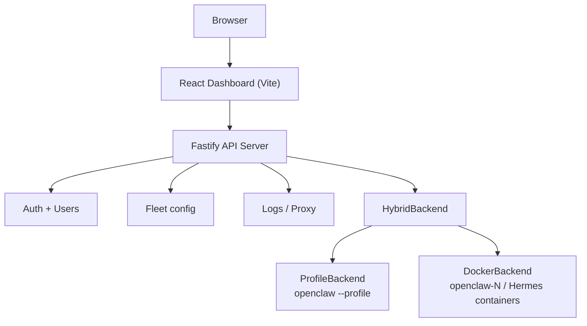

# README Refinement — Design Spec

**Date:** 2026-04-15  
**Branch:** mainpagerefine  
**Goals:** Clarity (Quick Start, Docker), Structure (Hermes section, Screenshots placement), Visual polish (gallery, table, Mermaid diagram)

---

## Problem Statement

The current README has three issues:

1. **Clarity:** Quick Start and Docker deployment sections contain too many sub-cases and inline caveats, making the happy path hard to follow.
2. **Structure:** The Hermes gateway section interrupts the main narrative flow between the capability table and screenshots. The screenshots section is stranded midway through the page.
3. **Visual/presentation:** The dashboard screenshot is unpaired; the screenshot gallery is sparse; the capability table has minor formatting inconsistencies; the architecture section uses ASCII art.

---

## Approach: Targeted Polish (Option A)

Keep the document's overall shape. Fix the specific pain points surgically.

---

## Document Structure (New Order)

```
1.  Title + badges + nav links
2.  Hero tagline + dashboard screenshot (keep as-is)
3.  "What it is" — one tightened paragraph merging current intro + why section
4.  Capability table — refined, Hermes folded in via existing columns + one-line note
5.  Screenshots gallery — 2×3 table of all 6 existing screenshots, promoted here
6.  Quick Start — dev mode: 4 commands + 1 config note + link to installation guide
7.  Docker deployment — 1 command + defaults table + link to docker-deployment guide
8.  Repo layout (keep)
9.  Architecture — Mermaid flowchart replacing ASCII art
10. Dev commands (keep)
11. Documentation links (keep, add docker-deployment)
12. License (keep)
```

---

## Section-by-Section Design

### 1. Title, Badges, Nav Links

No structural change. Add a link to `docs/guides/docker-deployment.md` in the nav bar alongside the existing links.

### 2. Hero

Keep the dashboard screenshot (`docs/guides/screenshots/00-dashboard.png`) at width 900. No change.

### 3. "What It Is" (merged intro)

Merge "Why this project exists" and the opening paragraph into a single tight block:

- One paragraph: what the manager does and what runtimes it supports.
- One bullet list (4–5 items): the concrete use cases currently in "Why this project exists".
- Remove redundancy between the two current sections.

### 4. Capability Table

Keep the existing table. Add a one-line note immediately below it:

> *Hermes instances share the fleet list with OpenClaw instances; OpenClaw-only features are hidden automatically.*

Remove the standalone **Hermes gateway support** section entirely — its content is fully covered by this note and the table columns.

### 5. Screenshots Gallery

Replace the current sparse 3-image table with a 2×3 table of all 6 existing screenshots:

| Live Logs | Metrics | User Management |
|---|---|---|
| Config | Plugins | Control UI |

Each cell: screenshot at width 260, bold caption above.

Existing images:
- `06-logs-tab.png` — Live Logs
- `06-metrics-tab.png` — Metrics
- `03-users-panel.png` — User Management
- `08-config-tab.png` — Config
- `07-plugins-tab.png` — Plugins
- `04-controlui-pending.png` — Control UI

### 6. Quick Start — Dev Mode

Replace the current multi-page quick start with:

```bash
npm install
cp packages/server/server.config.example.json packages/server/server.config.json
cp packages/web/.env.example packages/web/.env.local
npm run dev
```

One-line config note: *"Edit `server.config.json` to set `fleetDir`, `auth.username`, and `auth.password` before starting."*

Link: *"→ Full setup instructions: [Installation Guide](docs/guides/installation-guide.md)"*

Default endpoints (keep):
- Dashboard: `http://localhost:5173`
- API server: `https://localhost:3001`

All other detail (TLS, profile settings, Docker behavior, production hardening) moves to the installation guide.

### 7. Docker Deployment

Replace the current multi-section Docker block with:

```bash
./scripts/docker-deploy.sh
```

Compact defaults table:

| Default | Value |
|---|---|
| Manager URL | `http://localhost:3001` |
| Admin login | `admin` / `changeme` |
| Data root | `.docker-data/claw-fleet-manager` |

Link: *"→ Overrides, TLS, and image config: [Docker Deployment Guide](docs/guides/docker-deployment.md)"*

All override examples, env var tables, stop/logs commands, and constraints move to the new guide.

### 8. Repo Layout

Keep exactly as-is.

### 9. Architecture

Replace ASCII art with a Mermaid flowchart:



Keep the link to `docs/arch/README.md` for the full walkthrough.

### 10–12. Dev Commands, Docs Links, License

Keep as-is. Add `docs/guides/docker-deployment.md` to the Documentation section.

---

## New File: `docs/guides/docker-deployment.md`

Receives all content moved from the README Docker section:

- Overview of what the Docker deployment does
- Full `./scripts/docker-deploy.sh` usage
- All env var overrides (`ADMIN_USER`, `ADMIN_PASSWORD`, `MANAGER_PORT`, `OPENCLAW_IMAGE`, `BASE_URL`, `MODEL_ID`, `API_KEY`, `TLS_CERT`, `TLS_KEY`)
- Constraints (docker.sock mount, same absolute path requirement)
- Stop / logs commands
- Provider defaults for newly created instances

---

## Files Changed

| File | Action |
|---|---|
| `README.md` | Rewrite per this spec |
| `docs/guides/docker-deployment.md` | **New** — receives Docker deployment detail |
| `docs/guides/installation-guide.md` | No change needed (already has full Quick Start detail) |

---

## Success Criteria

- README Quick Start fits in ≤10 lines of commands + 2 prose lines
- Docker deployment fits in ≤5 lines + a small defaults table
- No standalone Hermes section
- Screenshots gallery shows all 6 screenshots in a 2×3 grid
- Architecture uses a Mermaid diagram
- All removed detail is preserved in the appropriate guide file
